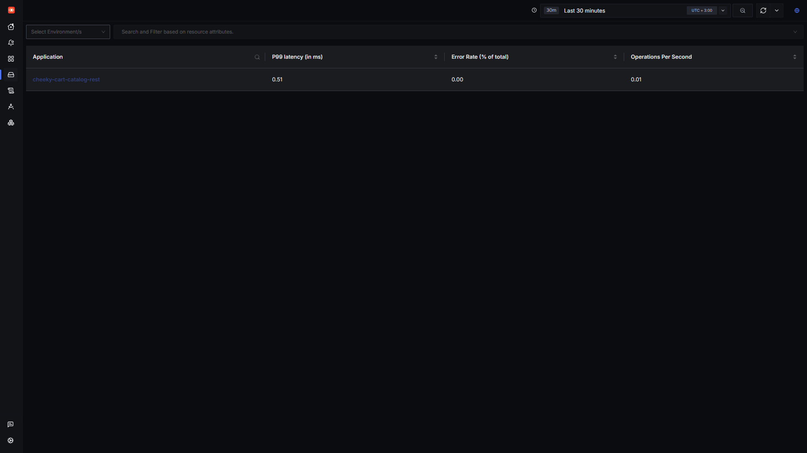
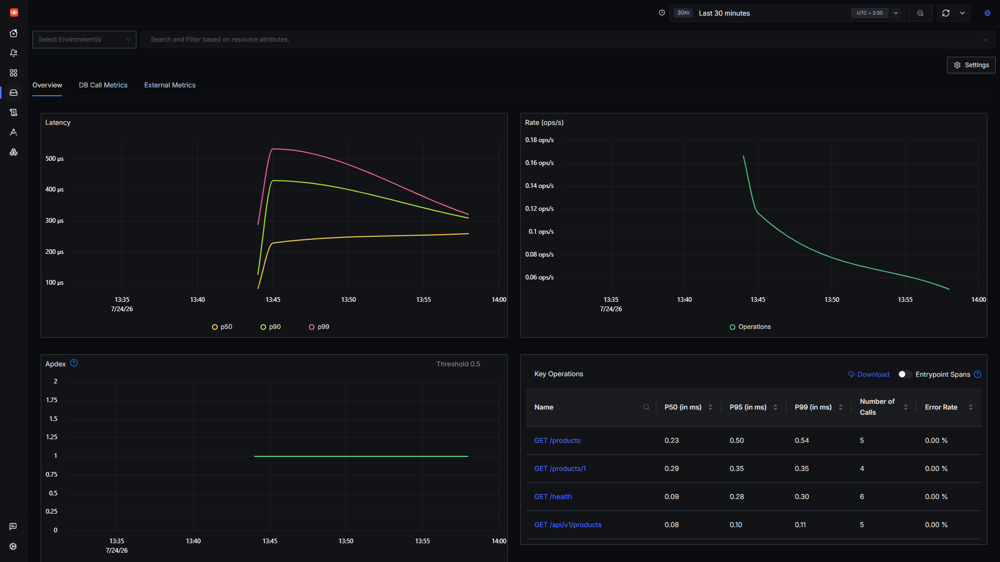
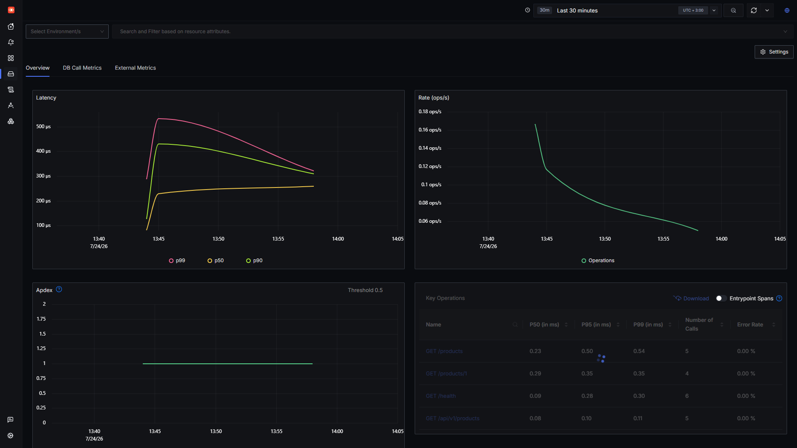
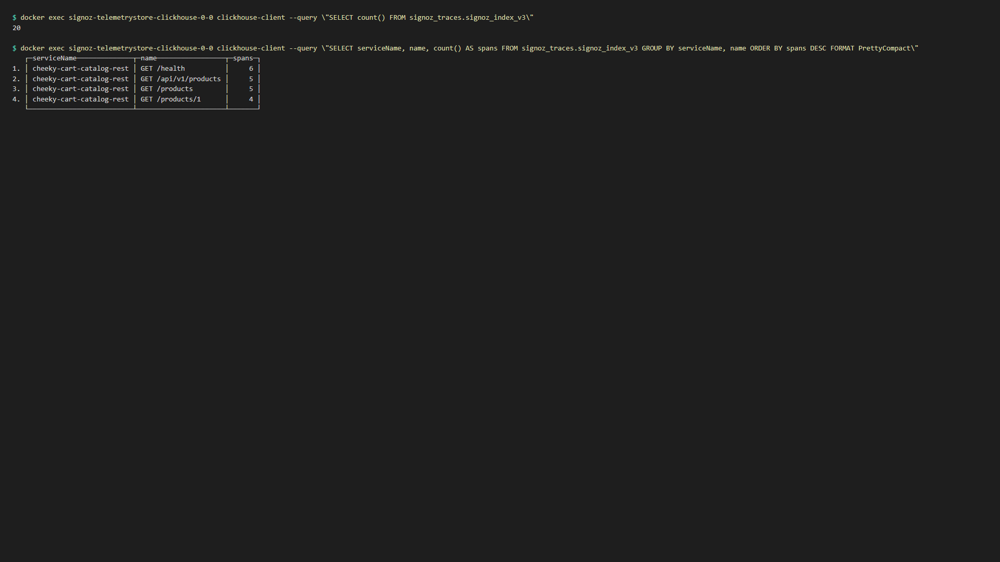

# SigNoz OTLP verification (L09 HW7)

Captured **2026-07-24** after fixing the ingester **nop-pipeline** issue (root user org bootstrap in `compose.override.yaml`).

Screenshots taken at **1920×1080** (maximized browser viewport).

## Environment

| Item | Value |
|------|-------|
| Stack | SigNoz Foundry via WSL native Docker (`scripts/start-signoz-wsl.ps1`) |
| SigNoz UI | http://localhost:8080 |
| Catalog REST | WSL `:8090`, `OTEL_EXPORTER_OTLP_ENDPOINT=127.0.0.1:4317`, `OTEL_EXPORTER_OTLP_PROTOCOL=grpc` |
| Service name | `cheeky-cart-catalog-rest` |

## SigNoz UI — Services list

`cheeky-cart-catalog-rest` appears under **Services** with latency and ops/s derived from exported spans:



## SigNoz UI — Service metrics & key operations

Drill into the service to see latency/rate charts and per-endpoint span counts (`GET /products`, `GET /health`, etc.):



Close-up of the **Key Operations** table (span names = HTTP method + path from `otelhttp` middleware):



## ClickHouse — backend proof

Same data visible in ClickHouse (`signoz_traces.signoz_index_v3`):



<details>
<summary>Raw ClickHouse queries (text)</summary>

```sql
SELECT count() AS total_traces FROM signoz_traces.signoz_index_v3
-- 20

SELECT serviceName, name, count() AS spans
FROM signoz_traces.signoz_index_v3
GROUP BY serviceName, name
ORDER BY spans DESC
```

```
   ┌─serviceName──────────────┬─name─────────────────┬─spans─┐
1. │ cheeky-cart-catalog-rest │ GET /health          │     6 │
2. │ cheeky-cart-catalog-rest │ GET /api/v1/products │     5 │
3. │ cheeky-cart-catalog-rest │ GET /products        │     5 │
4. │ cheeky-cart-catalog-rest │ GET /products/1      │     4 │
   └──────────────────────────┴──────────────────────┴───────┘
```

(`GET /api/v1/products` rows are from an initial smoke test with a wrong path; catalog routes are `/products` and `/products/{id}`.)

</details>

## Ingester config (OTLP active)

After org bootstrap + ingester restart, runtime config uses real `otlp` receivers (not `nop`):

```yaml
receivers:
    otlp:
        protocols:
            grpc:
            ...
pipelines:
    traces:
        receivers:
            - otlp
```

## Reproduce

```powershell
.\scripts\start-signoz-wsl.ps1
wsl -d Ubuntu-22.04 sh scripts/run-rest-wsl.sh
curl http://localhost:8090/products
```

Open http://localhost:8080 → **Services** → `cheeky-cart-catalog-rest`.
